# Code Callenge: Visual Thinking API

Consiste en una API donde se mostrara una lista de estudiantes donde también se filtraran los emails de todos los estudiantes que tengan certificación `haveCertification` y que todos los estudiantes que tengan `credits` mayor a 500. El propósito es para una tarea de "Code Challenge" de la semana 4 del curso "Backend Javascript" de LaunchX, un programa de cursos impartido por "Innovaccion Virtual" de Microsoft.

## Información del proyecto

Visual Partner-Ship te ha asignado el siguiente proyecto:

### Cursos de Visual Thinking API

Se tiene que crear un sistema que se conecte a un archivo JSON en donde se mostrara una lista de estudiantes con los atributos id, name, email, credits, enrollments, previousCourses y haveCertification.

### Requerimientos:

1. Habilitar un endpoint para consultar todos los estudiantes con todos sus campos.
2. Habilitar un endpoint para consultar los emails de todos los estudiantes que tengan certificación `haveCertification`.
3. Habilitar un endpoint para consultar todos los estudiantes que tengan `credits` mayor a 500.

### Dependencias a utilizar:

1. **JEST**: Es una librería que permite escribir y ejecutar tests.
2. **Supertest**: Es una librería que permite escribir y ejecutar tests para rutas con petición HTTP.
3. **esLinter**: Es la herramienta predominante para la tarea de "limpiar" código javascript tanto en el servidor (node.js) como en el navegador.
4. **Express**: Es un marco de servidor de aplicaciones web Node js, que está específicamente diseñado para compilar aplicaciones web híbridas, de una sola página y varias páginas.

## Estructura del proyecto

El proyecto contienen los archivos y carpetas necesarios para que funcione la aplicación.

### Archivos y carpetas necesarias para el funcionamiento del proyecto

- `.github`: Carpeta que se enlaza "Github Actions"
    - `workflows`: Carpeta que contiene los archivos para hacer las funciones de Github Actions, ya se para pruebas automáticas como hacer un deploy para subirlo a un servidor web.
        - `test.yml`: Archivo que contiene la configuración para las pruebas automáticas en Github Actions 
- `lib`: Consiste en una carpeta donde se encontraran las subcarpetas y archivos para la parte funcional del proyecto.
    - `controllers`: Carpeta donde contendrán los controladores y consiste en un intermediario entre los modelos y las vistas.
        - `StudentController.js`: Archivo que contiene el controlador con sus funciones heredadas de StudentService. 
    - `data`: Carpeta que contiene los datos a utilizar para el proyecto. Ya sea para tablas para luego migrarla a una base de datos o un archivo JSON para leerse.
        - `visualpartners.json`: Archivo con extension "JSON" que contienen los datos necesarios para el proyecto. 
    - `routes`: Carpeta que contiene un sistema de rutas que se encargan de manejar el flujo de solicitudes y respuestas, desde y hacia el cliente. Ahi se habilitara la dependencia `Express`.
        - `server.js`: Archivo que conectara a Express para crear un servidor web.  
    - `services`: Carpeta donde se pondrán los archivos para la lógica de negocio de un programa.
        - `StudentService.js`: Archivo que contiene la lógica de negocio de los requerimientos.  
    - `utils`: Carpeta que contiene para leer una archivo JSON o habilitara la conexión a una base de datos al proyecto.
        - `Reader.js`: Archivo que configurara la lectura del archivo JSON que se encuentra en la carpeta data. 
- `node_modules`: Carpeta que contiene las dependencias NodeJS que se conecta tanto en `package-lock.json` como en `package.json`. Esta se debe de ignorar para que no se suba al repositorio en Github.
- `test`: Consiste en una carpeta donde se administra las pruebas de código, es la carpeta que lee la dependencia `Jest`.
    - `controllers`: Carpeta donde contiene la prueba de los controladores.
        - `StudentController.test.js`: Archivo que contiene el controlador para probar las funciones. 
    - `data`: Carpeta donde contienen los archivos los datos a probar para los tests.
        - `visualpartners-test.json`: Archivo con extension "JSON" que contienen los datos necesarios para probar el proyecto. 
    - `routes`: Carpeta donde contienen archivos para probar las rutas HTTP del proyecto. Ahi se habilitara la dependencia `Supertest`.
        - `server.test.js`: Archivo que conectara a Express para probar las peticiones HTTP.  
    - `services`: Carpeta donde se probaran los archivos Services.
        - `StudentService.js`: Archivo que contiene las pruebas para la lógica de negocio de los requerimientos.  
    - `utils`: Carpeta que contiene para leer una archivo JSON para leer en la prueba o llenar datos ficticios a una base de datos.
        - `Reader.js`: Archivo que configurara la la prueba para leer un archivo JSON que se encuentra en la carpeta data.  
- `.eslintrc.js`: Archivo que contiene la configuración para darle formato al proyecto mediante la dependencia `esLinter`. 
- `.gitignore`: Archivo que tiene la función de ignorar carpetas y archivos con información delicada.
- `index.js`: Archivo que hará funcionar el proyecto. 
- `package-lock.json`: Archivo que contiene las dependencias secundarias que hará funcionar NodeJS.
- `package.json`: Archivo que contiene la información del proyecto y los comandos necesarios para poder utilizarlo.
- `README.md`: Archivo con extensión markdown para describir el repositorio, servirá mucho para los repositorios en Github.

### Diagrama UML

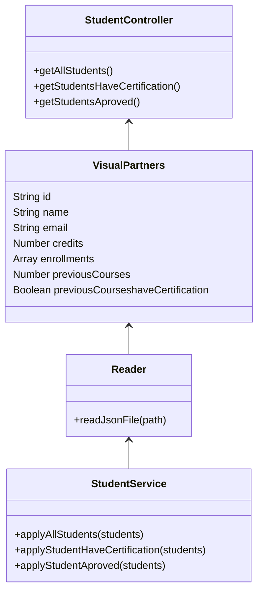

### Tabla de rutas para el proyecto

| Petición | Ruta | Resultado |
| ------------- | ------------- | ------------- |
| GET | `http://localhost:3000` | Obtener mensaje de bienvenida |
| GET | `http://localhost:3000/estudiantes` | Obtener lista de todos los estudiantes |
| GET | `http://localhost:3000/estudiantes/emails/certificacion` | Obtener lista de todos los emails de los estudiantes con certificación en `true` |
| GET | `http://localhost:3000/estudiantes/aprobados` | Obtener lista de todos los estudiantes que su `credits` es mayor a 500 |

### Algoritmo
1. Inicio
2. Ingresar la dirección dependiendo de la tabla de en el navegador.
3. La información se enviá al archivo `lib/services/StudentService.js` para definir la función.
4. El parametro para enviarlo a archivo `Service` es el archivo `lib/utils/reader.js` mediante el funcionamiento para leer el archivo JSON.
5. El archivo JSON que se leera es `lib/data/virtualparters.json`.
6. Se envia ese parámetro al controlador `lib/controllers/StudentController.js` que se conectara a la función del archivo `Service`.
7. La información del archivo `Controller` se enviá al archivo `lib/routes/api.js` que administra las rutas de acceso.
8. Las rutas preparadas en `api` se enviá a un archivo llamado `lib/server.js` que prepara las funciones para que se muestre al navegador.
9. Al final, el `server` se declara en el archivo `index.js` que servirá como una vista para la API.
10. Fin

### Diagramas de flujo

#### Flujo de información

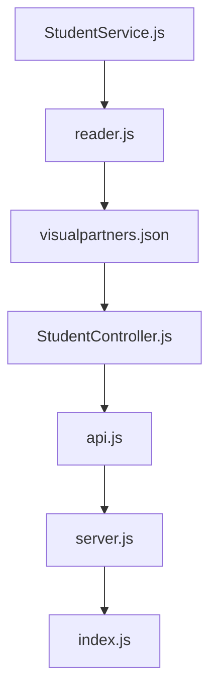

#### Lógica de la aplicación
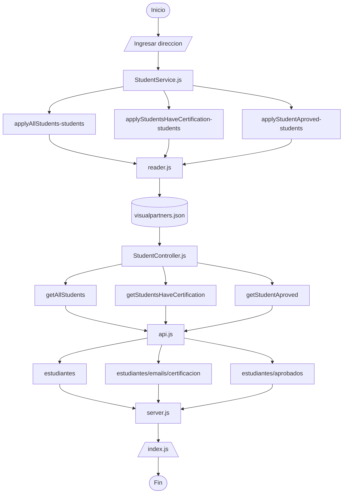

### Primeros archivos y carpetas

El primer archivo que se debe de colocar es `index.js` que servirá como enlace principal para hacer funcionar la aplicación.

Archivo: `index.js`

```
console.log("Hola mundo");
```

Después se crea las carpetas `lib` y `test` que servirán para el funcionamiento y las pruebas y dentro de ella estarán estas carpetas

1. `controllers`
2. `data`
3. `routes`
4. `services`
5. `utils`

Dentro de la carpeta `data` ubicada en `lib` colocar el archivo JSON `visualpartners.json` y en la carpeta `data` ubicada en `test` colocar el archivo `visualpartners-test.json` como un medio para conectarse a la aplicación.

## Uso de Github con comandos Git

Ahora ya teniendo listo la estructura de archivos y carpetas, ahora se subirán a un repositorio en `Github` mediante los comandos de control de versiones llamado `GIT`.

### Commit: Subir proyecto a un repositorio de Github

Lo primero que se debe de crear el repositorio en Github con el nombre "visual-thinking-api" y dependiendo de la visibilidad del proyecto puede ser publico para que lo vean todo los usuarios o privado para que algunos con invitación del autor del repositorio lo pueda ver. En este caso el repositorio estará en publico.

#### Crear repositorio en Github

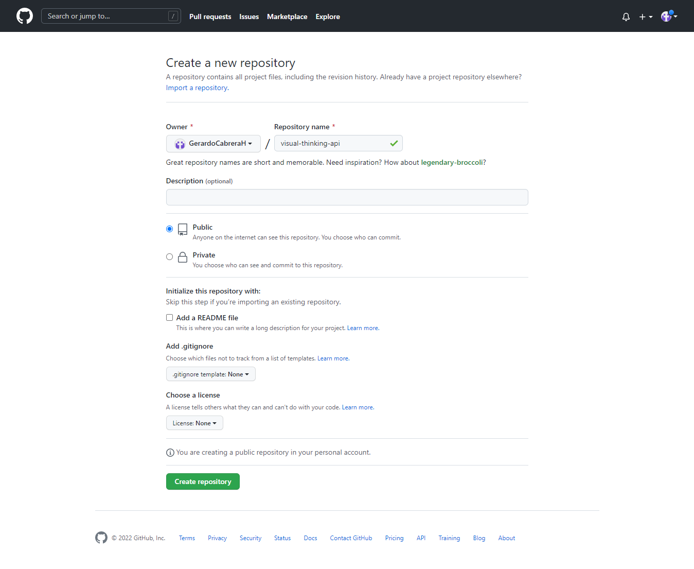

#### Iniciar `git` en proyecto local
1. Iniciar Git mediante el comando `git init`.
2. Agregar el nombre completo mediante el comando `git config user.name "Nombre completo"`.
3. Agregar el email mediante el comando `git config user.emai "Correo electronico"`.

#### Procedimiento para crear commits y ramas
1. Agregar archivos al repositorio `git add .`
2. Crear commit `git commit -m "git commit -m "Nombre del commit"`.
3. Poner commit en una rama mediante el comando `git branch -M main`.

#### Asociarlo a un repositorio por primera vez
1. Si es por primera vez que se sube un proyecto a un repositorio poner el comando para añadir una ruta para el repositorio `git remote add origin ruta-del-repositorio`.

#### Subir el proyecto al repositorio
1. Despues de hacer la asociación a un repositorio si es la primera vez o si ya puso el commit a una rama, entonces ya comienza con la subida del proyecto mediante el comando `git push -u origin main` y lo primero que se pondrá es el nombre de usuario de Github y darle enter para luego poner su contraseña, esta es generada para acceder a la API de Github y se puede generar en "Settings/Developer settings/Personal access tokens".

## Instalación de proyecto de NodeJS

Ahora que se subió el proyecto a Github, ahora se debe de crear un proyecto para NodeJS con las dependencias Express, Jest, Supertest y esLinter.

### Commit: Subir configuración NodeJS a Github

#### Creación del proyecto
1. Instalar proyecto en NodeJS mediante el comando `npm init -y` y se crea un archivo llamado `package.json` donde se contendrá toda la información del proyecto.
2. Poner el nombre del autor en `"author": "GerardoCabreraH"`.
3. Habilitar el comando para iniciar el proyecto en el apartado `"scripts"` `"start": "node index.js"`.

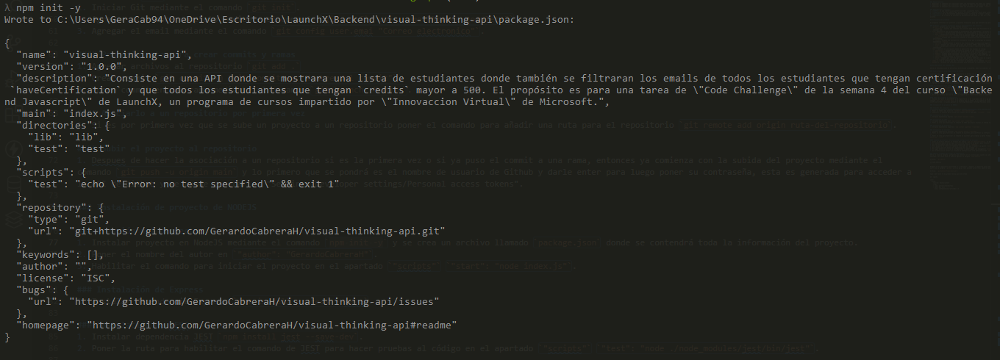

#### Instalación de Express
1. Instalar dependencia Express `npm install express --save`.

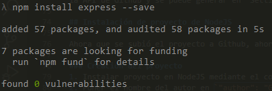

#### Instalación de Supertest
1. Instalar dependencia Supertest `npm install supertest --save-dev`.

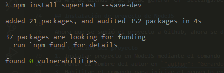

#### Instalación de Jest
1. Instalar dependencia JEST `npm install jest@26.0.0 --save-dev`.
2. Poner la ruta para habilitar el comando de JEST para hacer pruebas al código en el apartado `"scripts"` `"test": "node ./node_modules/jest/bin/jest"`.

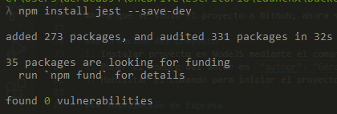

#### Instalación de esLinter
1. Instalar dependencia esLinter `npm install eslint --save-dev`.
2. Poner la ruta para habilitar el comando de esLinter para verificar la sintaxis del código en el apartado `"scripts"` `"linter": "node ./node_modules/eslint/bin/eslint.js"`.
4. Poner la ruta para habilitar el comando de esLinter para limpiar y darle formato al código en el apartado `"scripts"` `"linter-fix": "node ./node_modules/eslint/bin/eslint.js . --fix"`

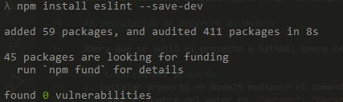

##### Comando para definir el archivo de configuración de esLinter
1. Crear un archivo definir el formato del código `npm init @eslint/config`, se debe de poner también si se versiona la dependencia.
2. El comando preguntara para que se utilizara esLinter y se pondrá para resolver problemas de sintaxis `problems`.
3. El tipo de modulo debe de ser para Javascript común `commonjs`.
4. Este proyecto no tiene un Framework utilizado asi que se pondrá la opción `none`.
5. El proyecto no esta hecho para Typescript asi que se pone `no`.
6. El lugar donde se correrá la configuración se pondrá para los navegadores `browser`.
7. El formato que se correrá el archivo de configuración sera para Javascript `JavaScript`.

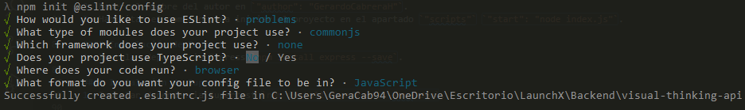

##### Archivo de configuración de esLinter
Ahora se modifica el archivo para definir el formato y la sintaxis del código.

Archivo: `.eslintrc.js`
```
module.exports = {
    "env": {
        "browser": true,
        "commonjs": true,
        "es2021": true,
        "jest": true
    },
    "extends": "eslint:recommended",
    "parserOptions": {
        "ecmaVersion": "latest"
    },
    "rules": {
        "indent": ["error", 4],
        "linebreak-style": ["error", "unix"],
        "quotes": ["error", "double"],
        "semi": ["error", "always"]
    }
};
```

Después corre los comandos asignados para esLinter.

- **Verificar sintaxis**: `npm run linter`
- **Arreglar sintaxis**: `npm run linter-fix`

**Verificar sintaxis**

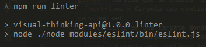

**Arreglar sintaxis**

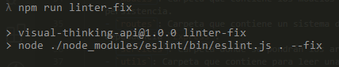

#### Ignorar carpetas para subir al repositorio
Ahora se crea la carpeta .gitignore que consiste en un archivo para cuando se suba un proyecto ignorar carpetas con mucha capacidad o archivos que contiene información delicada. Para este caso se debe de ignorar la carpeta `node_modules`.

Archivo: `.gitignore`: 

```
**/node_modules
```

Después se la configuración sube al repositorio Github.

## Configurar Reader para leer datos de un archivo JSON

Ahora que ya esta listo el proyecto, ahora se comenzara a usar el archivo `visualpartners.json`

### Commit: Subir configuración Read a Github

#### Habilitar pruebas automáticas
Primero en el repositorio de Github ir a "Actions" y después se habilita para poder usar la carpeta .github. Crear un archivo llamado `test.yml` en la carpeta `workflows` dentro de la carpeta `.github` y sirve para crear pruebas automáticas cada vez que se sube una modificación local al repositorio.

Archivo: `.github/workflows/test.yml`: 
```
name: Run Tests in my project every push on GitHub

on: [push]

jobs:
  build:
    runs-on: ubuntu-latest
    steps:
    - uses: actions/checkout@v1
    - name: Run Jest
      uses: stefanoeb/jest-action@1.0.3
```

#### Crear configuración para leer archivos JSON

Ahora se debe de crear la función `readJsonFile` para leer el archivo JSON con el parametro `path`.

Archivo: `lib/utils/reader.js`: 
```
const fs = require("fs");

class Reader {
    static readJsonFile(path) {
        const rawdata = fs.readFileSync(path);
        return JSON.parse(rawdata);
    }
}

module.exports = Reader;
```

#### Probar configuración para leer archivos JSON

Despúes se debe de probar el código para ver si funciona el archivo.

Archivo: `test/utils/reader.test.js`: 

```
const Reader = require("./../../lib/utils/reader");

describe("Pruebas unitarias para el Reader", () => {
    test("Requerimiento 01: Contar los datos de muestra", () => {
        const explorers = Reader.readJsonFile("./test/data/visualpartners-test.json");
        expect(explorers.length).toBe(51);
    });
});
```

### Toques finales

Darle formato al proyecto.

- **Verificar sintaxis**: `npm run linter`
- **Arreglar sintaxis**: `npm run linter-fix`

Luego se sube las modificaciones a Github y hay errores se solucionan para luego subir las modificaciones con el mismo nombre del commit anterior, pero con un parentesis que de forma resumida la solución.

## Requerimiento 01: Habilitar un endpoint para consultar todos los estudiantes con todos sus campos

El proyecto debe de tener habilitado un endpoint que busca consultar todos los estudiantes con todos los sus campos.

### Commit: Subir Requerimiento 01 a Github

#### Crear la lógia de negocio

Para implementar esa logica de negocio, se debe de crear codigo dentro de la carpeta `lib`

##### Crear funcion applyAllStudents con el parametro student en el archivo `studentService.js` dentro de la carpeta `services`

```
class StudentService {
    static applyAllStudents(students) {
        return students;
    }
}

module.exports = StudentService;
```

##### Crear funcion getAllStudents en el archivo `studentController.js` dentro de la carpeta `controllers`

```
const StudentService = require("../services/StudentService");
const Reader = require("../utils/reader");

class StudentController {
    static getAllStudents() {
        const students = Reader.readJsonFile("./lib/data/visualpartners.json");
        return StudentService.applyAllStudents(students);
    }
}

module.exports = StudentController;
```

#### Probar la lógia de negocio

Para probar esa logica de negocio, se debe de crear codigo dentro de la carpeta `test`

##### Probar la funcion applyAllStudents con el parametro student en el archivo `studentService.test.js` dentro de la carpeta `services`

```
const StudentService = require("./../../lib/services/StudentService");
const Reader = require("./../../lib/utils/reader");

describe("Pruebas unitarias para StudentService", () => {    
    test("Requerimiento 01: Habilitar un endpoint para consultar todos los estudiantes con todos sus campos", () => {
        const students = Reader.readJsonFile("./lib/data/visualpartners.json");
        const studentsList = students.map((student) => StudentService.applyAllStudents(student));
        expect(studentsList.length).toBe(51);
    });
});
```

##### Probar la funcion getAllStudents en el archivo `studentController.test.js` dentro de la carpeta `controllers`

```
const StudentController = require("./../../lib/controllers/StudentController");

describe("Pruebas unitarias para StudentController", () => {    
    test("Requerimiento 01: Habilitar un endpoint para consultar todos los estudiantes con todos sus campos", () => {
        const students = StudentController.getAllStudents();
        expect(students.length).toBe(51);
    });
});
```

### Toques finales

Darle formato al proyecto

- **Verificar sintaxis**: `npm run linter`
- **Arreglar sintaxis**: `npm run linter-fix`

Luego se sube las modificaciones a Github y hay errores se solucionan para luego subir las modificaciones con el mismo nombre del commit anterior, pero con un parentesis que de forma resumida la solución.

## Requerimiento 02: Habilitar un endpoint para consultar los emails de todos los estudiantes que tengan certificación `haveCertification`.

Ahora se debe de crear un endpoint donde se debe de consultar los emails de todos los estudiantes que tengan certificación en true.

### Commit: Subir Requerimiento 02 a Github

#### Crear la lógia de negocio

Para implementar esa logica de negocio, se debe de crear codigo dentro de la carpeta `lib`

##### Crear funcion applyStudentsHaveCertification con el parametro student en el archivo `studentService.js` dentro de la carpeta `services`

```
const Student = require("./../../lib/models/student");

class StudentService {
    ...
    static applyStudentsHaveCertification(students) {
        const studentsWithcertification = students.filter((student) => student.haveCertification === true);
        return studentsWithcertification.map((student) => student.email);
    }
}

module.exports = StudentService;
```

##### Crear funcion getStudentsHaveCertification en el archivo `studentController.js` dentro de la carpeta `controllers`

```
const StudentService = require("../services/studentService");
const Reader = require("../utils/reader");

class StudentController {
    ...
    static getStudentsHaveCertification() {
        const students = Reader.readJsonFile("./lib/data/visualpartners.json");
        return StudentService.applyStudentsHaveCertification(students);
    }
}

module.exports = StudentController;
```

#### Probar la lógica de negocio

Para probar esa lógica de negocio, se debe de crear código dentro de la carpeta `test`

##### Probar la funcion applyStudentsHaveCertification con el parametro student en el archivo `studentService.test.js` dentro de la carpeta `services`

```
const StudentService = require("./../../lib/services/StudentService");
const Reader = require("./../../lib/utils/reader");

describe("Pruebas unitarias para StudentService", () => {
    ...
    test("Requerimiento 02: Habilitar un endpoint para consultar los emails de todos los estudiantes que tengan certificacion", () => {
        const students = Reader.readJsonFile("./lib/data/visualpartners.json");
        const studentsList = StudentService.applyStudentsHaveCertification(students);
        expect(studentsList.length).toBe(29);
    });
});
```

##### Probar la funcion getStudentsHaveCertification en el archivo `studentController.test.js` dentro de la carpeta `controllers`

```
const StudentController = require("./../../lib/controllers/StudentController");

describe("Pruebas unitarias para StudentController", () => {    
    test("Requerimiento 02: Habilitar un endpoint para consultar los emails de todos los estudiantes que tengan certificacion", () => {
        const students = StudentController.getStudentsHaveCertification();
        expect(students.length).toBe(29);
    });
});
```

### Toques finales

Darle formato al proyecto.

- **Verificar sintaxis**: `npm run linter`
- **Arreglar sintaxis**: `npm run linter-fix`

Luego se sube las modificaciones a Github y hay errores se solucionan para luego subir las modificaciones con el mismo nombre del commit anterior, pero con un parentesis que de forma resumida la solución.

## Habilitar un endpoint para consultar todos los estudiantes que tengan `credits` mayor a 500.

Ahora se debe de crear un endpoint donde se debe de consultar todos los estudiantes que sus creditos sean mayor a 500.

### Commit: Subir Requerimiento 03 a Github

#### Crear la lógia de negocio

Para implementar esa logica de negocio, se debe de crear codigo dentro de la carpeta `lib`

##### Crear funcion applyStudentsApprove con el parametro student en el archivo `studentService.js` dentro de la carpeta `services`

```
class StudentService {
    ...
    static applyStudentsApprove(students) {
        const studentsApprove = students.filter((student) => student.credits > 500);
        return studentsApprove;
    }
}

module.exports = StudentService;
```

##### Crear funcion getStudentsApprove en el archivo `studentController.js` dentro de la carpeta `controllers`

```
const StudentService = require("../services/studentService");
const Reader = require("../utils/reader");

class StudentController {
    ...
    static getStudentsApprove() {
        const students = Reader.readJsonFile("./lib/data/visualpartners.json");
        return StudentService.applyStudentsApprove(students);
    }
}

module.exports = StudentController;
```

#### Probar la lógia de negocio

Para probar esa logica de negocio, se debe de crear codigo dentro de la carpeta `test`

##### Probar la funcion applyStudentsApprove con el parametro student en el archivo `studentService.test.js` dentro de la carpeta `services`

```
const StudentService = require("./../../lib/services/StudentService");
const Reader = require("./../../lib/utils/reader");

describe("Pruebas unitarias para StudentService", () => {
    ...
    test("Requerimiento 03: Habilitar un endpoint para consultar todos los estudiantes que tengan credits mayor a 500", () => {
        const students = Reader.readJsonFile("./lib/data/visualpartners.json");
        const studentsList = StudentService.applyStudentsApprove(students);
        expect(studentsList.length).toBe(27);
    });
});
```

##### Probar la funcion getStudentsApprove en el archivo `studentController.test.js` dentro de la carpeta `controllers`

```
const StudentController = require("./../../lib/controllers/StudentController");

describe("Pruebas unitarias para StudentController", () => {    
    test("Requerimiento 02: Habilitar un endpoint para consultar todos los estudiantes que tengan credits mayor a 500", () => {
        const students = StudentController.getStudentsApprove();
        expect(students.length).toBe(27);
    });
});
```

### Toques finales

Darle formato al proyecto.

- **Verificar sintaxis**: `npm run linter`
- **Arreglar sintaxis**: `npm run linter-fix`

Luego se sube las modificaciones a Github y hay errores se solucionan para luego subir las modificaciones con el mismo nombre del commit anterior, pero con un parentesis que de forma resumida la solución.

## Habilitar servidor web

Ya despues de probar los services y los controllers, ya se comienza con el habilitación del servidor web.

### Commit: Subir configuración del servidor web a Github

### Configurar rutas web.

Se realiza esta acción dentro de la carpeta `lib`

#### Habilitar dependencia de Express y crear rutas endpoint en el archivo `api.js` dentro la carpeta `routes`

```
const StudentController = require("./../../lib/controllers/StudentController");
const express = require("express");
const app = express();

app.use(express.json());

app.get("/", (request, response) => {
    response.json({ message: "Visual Thinking Api welcome!" });
});

app.get("/estudiantes", (request, response) => {
    response.json(StudentController.getAllStudents());
});

app.get("/estudiantes/emails/certificacion", (request, response) => {
    response.json(StudentController.getStudentsHaveCertification());
});

app.get("/estudiantes/aprobados", (request, response) => {
    response.json(StudentController.getStudentsApprove());
});

module.exports = app;
```

#### En el archivo `server.js` ahora se debe de importar el archivo `routes.js` dentro de para llamar al servidor web

```
const api = require("./../lib/routes/api");

const start = (port) => {
    try {
        api.listen(port, () => {
            console.log(`Visual Thinking API in localhost:${port}`);
        });
    } catch (err) {
        console.error(err);
    }
};

module.exports = start;
```

#### Por ultimo habilitar el puerto para poder iniciar el servidor web en el archivo `index.js`
```
const start = require("./lib/server");

start(3000);
```

### Probar servidor web

Este funcionamiento se coloca en la carpeta `test`

#### Ahora se prueba las rutas del servidor web mediante el archivo `api.test.js` dentro de la carpeta `routes`

```
const app = require("./../lib/routes/api");
const request = require("supertest");

describe("Probar rutas del servidor", () => { 
    test("Probar ruta principal", (done) => {
        request(app)
            .get("/")
            .expect(200)
            .expect((res) => {
                expect((res.body).message).toBe("Visual Thinking Api welcome!");
            })
            .end((err) => {
                if (err) return done(err);
                return done();
            });
    });

    test("Requerimiento 01: Habilitar un endpoint para consultar todos los estudiantes con todos sus campos", (done) => {
        request(app)
            .get("/estudiantes")
            .expect(200)
            .expect((res) => {
                expect(res.body.length).toBe(51);
            })
            .end((err) => {
                if (err) return done(err);
                return done();
            });
    });

    test("Requerimiento 02: Habilitar un endpoint para consultar los emails de todos los estudiantes que tengan certificacion", (done) => {
        request(app)
            .get("/estudiantes/emails/certificacion")
            .expect(200)
            .expect((res) => {
                expect(res.body.length).toBe(29);
            })
            .end((err) => {
                if (err) return done(err);
                return done();
            });
    });

    test("Requerimiento 03: Habilitar un endpoint para consultar todos los estudiantes que tengan credits mayor a 500", (done) => {
        request(app)
            .get("/estudiantes/aprobados")
            .expect(200)
            .expect((res) => {
                expect(res.body.length).toBe(27);
            })
            .end((err) => {
                if (err) return done(err);
                return done();
            });
    });
});
```

### Toques finales

Darle formato al proyecto.

- **Verificar sintaxis**: `npm run linter`
- **Arreglar sintaxis**: `npm run linter-fix`

Luego se sube las modificaciones a Github y hay errores se solucionan para luego subir las modificaciones con el mismo nombre del commit anterior, pero con un parentesis que de forma resumida la solución.

## Recopilación de errores en las pruebas

En esta parte se pusieron todos los errores de las pruebas automaticas y sus soluciones

---

**Problema**: Numero incorrecto en el total de usuarios con certificacion
**Commit**: Subir Requerimiento 02 a Github

**Archivo**: `test/services/StudentService.test.js`
**Commit solucion**: `Subir Requerimiento 02 a Github (Corregir problema de total de usuarios con certificacion)`
**Solución**: Cambiar numero de 51 a 29

**Archivo**: `test/controllers/StudentController.test.js`
**Commit solucion**: `Subir Requerimiento 02 a Github (Corregir problema de total de usuarios con certificacion)`
**Solución**: Cambiar numero de 51 a 29

---

**Problema**: Numero incorrecto en el total de usuarios con creditos mayor a 500
**Commit**: Subir Requerimiento 03 a Github

**Archivo**: `test/services/StudentService.test.js`
**Commit solución**: `Subir Requerimiento 02 a Github (Corregir problema de total de usuarios con credits mayor a 500)`
**Solución**: Cambiar numero de 29 a 27

**Archivo**: `test/controllers/StudentController.test.js`
**Commit solución**: `Subir Requerimiento 02 a Github (Corregir problema de total de usuarios con credits mayor a 500)`
**Solución**: Cambiar numero de 29 a 27

---

**Problema**: Ruta incorrecta del servidor
**Commit**: Subir configuración del servidor web a Github

**Archivo**: `test/routes/StudentController.js`
**Commit solución**: `Subir configuración del servidor web a Github (Cambiar ruta correcta del requerimiento 03`
**Solucion**: Cambiar la ruta del requerimiento 03 de `/v1/estudiantes/aprobados` a `/estudiantes/aprobados`

---

## Resultados

Se muestran los resultados de la api.

### Commit: Subir documentación al servidor 

#### Pruebas del test resueltas

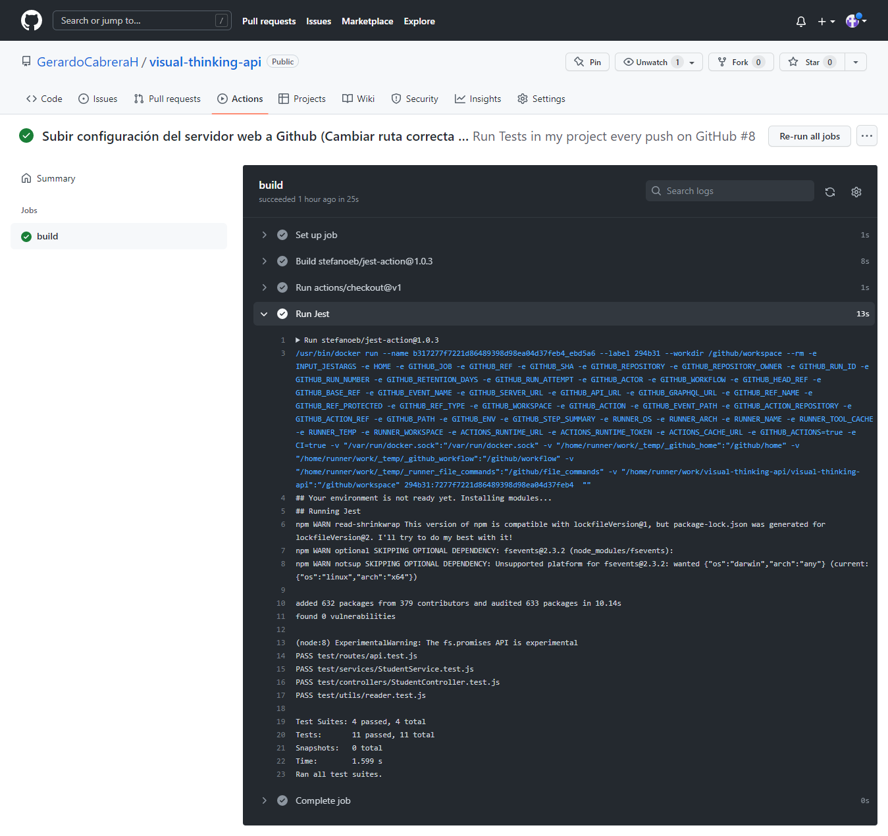

#### Resultados en el navegador

Ruta raiz:

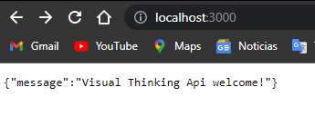

Requerimiento 01:

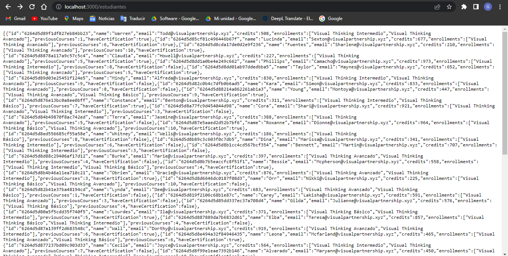

Requerimiento 02:

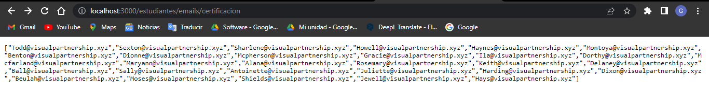

Requerimiento 03:

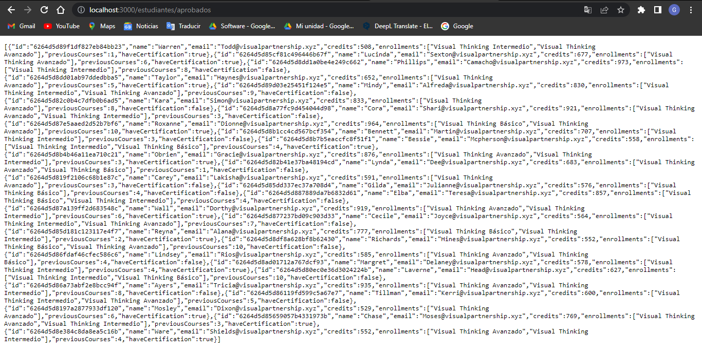